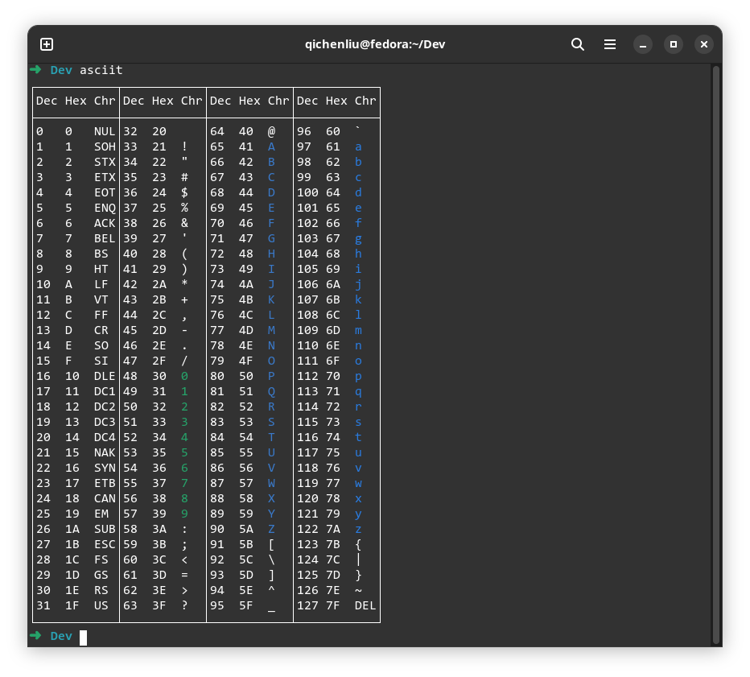
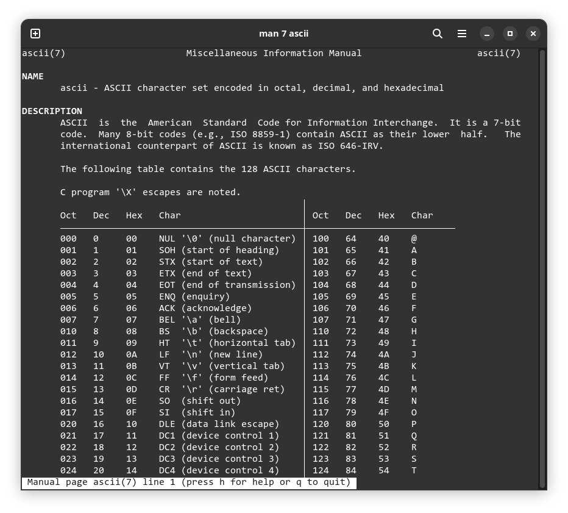

# asciit

A more compact and intuitive ASCII table in your terminal: an alternative to `man 7 ascii`. Colored numbers and letters are much more easier to find.

## Screenshot

`asciit`

`man 7 ascii`

