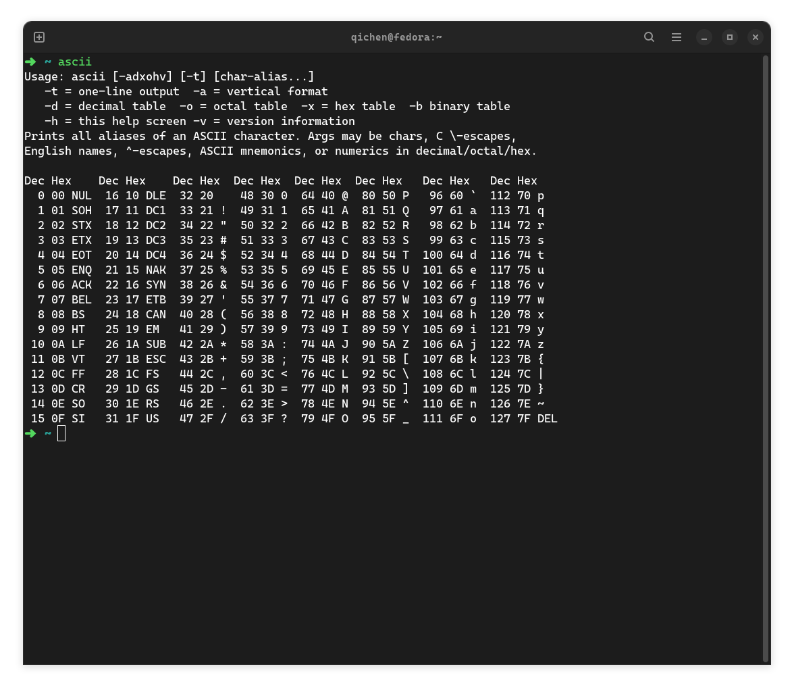

# asciit

A more compact and intuitive ASCII table in your terminal: an alternative to `man 7 ascii` and `ascii`. Colored numbers and letters are much more easier to find. The table style is inspired by [hexyl](https://github.com/sharkdp/hexyl)

## Build

```shell
git clone https://github.com/Q1CHENL/asciit
cd asciit
cargo build --release
```

## Installation

- Cargo

```bash
cargo install asciit
```

- Fedora Linux:

```bash
dnf copr enable qichen/asciit # enable the repo
dnf install asciit # install
```

- Arch Linux:

```bash
yay -S asciit
```

- Clone and install

```bash
git clone https://github.com/Q1CHENL/asciit
cd asciit
cargo install --path .
```

## Screenshots & Comparison

`asciit` or `asciit v`

`man 7 ascii`

`asciit h --no-explain`

`ascii`


## Notice

- Size of vertical table: 77 x 36
- Size of horizontal table: 153 x 20

You may need to adjust your terminal window size to view the entire vertical table or ensure the correct horizontal display.
