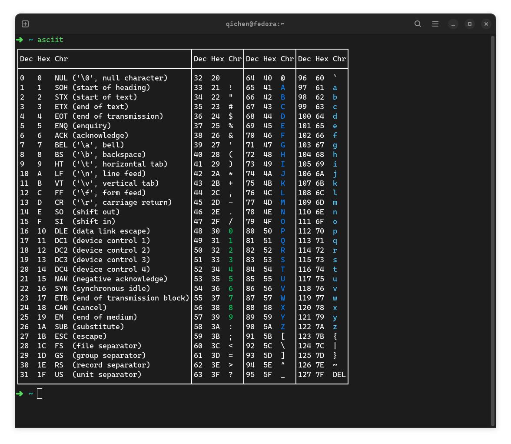
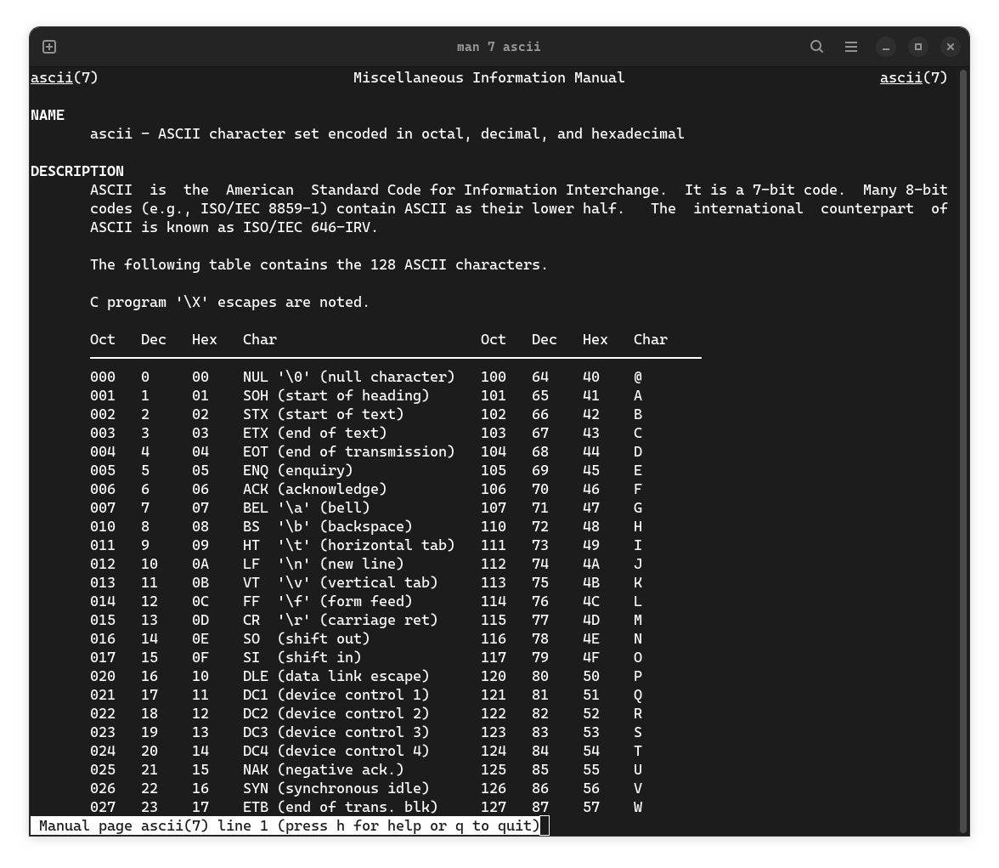

# asciit

A more compact and intuitive ASCII table in your terminal: an alternative to `man 7 ascii` and `ascii`. Colored numbers and letters are much more easier to find. The table style is inspired by [hexyl](https://github.com/sharkdp/hexyl)

## Build

```shell
git clone https://github.com/Q1CHENL/asciit
cd asciit
cargo build --release
```

## Installation

- Fedora Linux:

```shell
dnf copr enable qichen/asciit # enable the repo 
dnf install asciit # install
```

- Other platforms:

```shell
git clone https://github.com/Q1CHENL/asciit
cd asciit
cargo install --path .
```

## Screenshots

`asciit` or `asciit v`

`man 7 ascii`

`asciit h`

`ascii`


## Note

- size of vertical table: 49x30
- size of horizontal table: 97x20

You may need to adjust your terminal window size to view the entire vertical table or to ensure correct display of the horizontal one.
